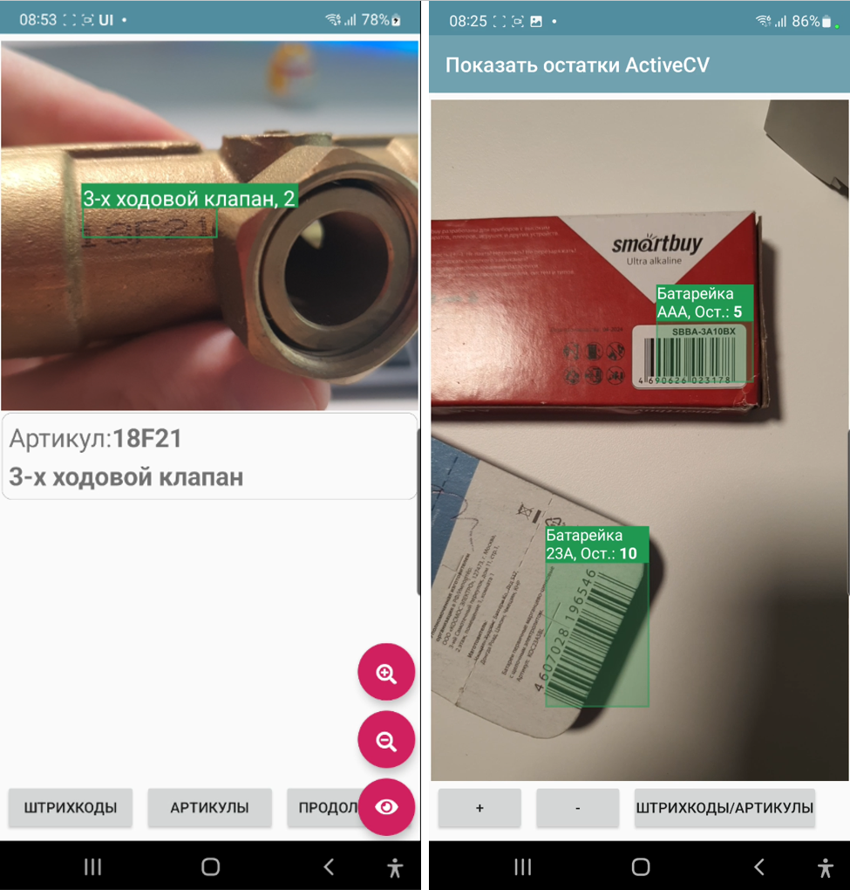
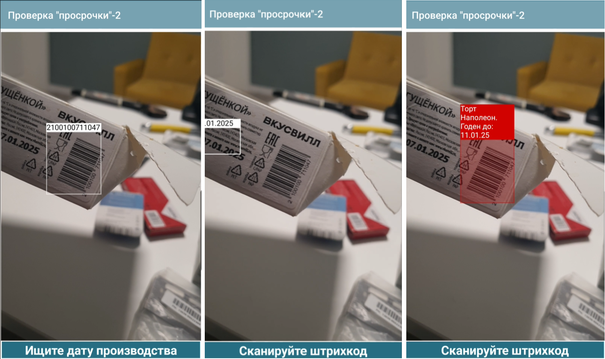

.. NodaLogic documentation master file, created by
   sphinx-quickstart on Wed Nov  5 07:29:33 2025.
   You can adapt this file completely to your liking, but it should at least
   contain the root `toctree` directive.

Компьютерное зрение и дополненная реальность ActiveCV
========================================================

ActiveCV – это технология автоматизации бизнес-процесса, когда все необходимые данные бизнес-процесса выводятся не на экран, а сразу в видеопоток, при этом с камерой работают различные детекторы: штрихкодов, OCR, лиц и т.д. Также смысл сего действия в беспрерывной работе оператора без необходимости каких то переключений. Например, запустил ActiveCV – отсканировал код помещения, не прерываясь и ничего не нажимая переключился на сканирование инвентарных кодов оборудования, VIN-ов, далее серии фото этого оборудования и все это, не переключаясь на обычные экраны с кнопками. И пошел дальше к другим объектам.  

Важным свойством технологии является подсветка объектов разными цветами – цветовая маркировка. Примеры цветовой маркировки:

 * объект находится там, где надо — зеленый цвет, там, где не надо — красный.
 * объект проинвентаризирован — зеленый цвет, не проинвентаризирован — желтый.
 * заказ просрочен по дедлайну — красный, подходит срок — желтый, не просрочен — зеленый

Примеры (лучше смотреть видео или GIFы) по технологии собраны в этих статьях (на платформе было 2 генерации ActiveCV: первая, в виде самостоятельно процесса - устарела, в виде элмента экрана - актуальная):

 * https://habr.com/ru/articles/874560/

Обзор механизмов работы.
-----------------------------

Размещение визуального элемента.
~~~~~~~~~~~~~~~~~~~~~~~~~~~~~~~~~

.. image:: _static/2025_cv_2.png
       :scale: 75%
       :align: center

Размещение на экране ничем не отличается от других элементов разметки. Сам визуальный элемент называется ActiveCV. Можно разместить на часть контейнера, весь экран. И также с помощью команды RunCV можно запустить полноэкранный режим без каких либо дополнительных элементов в отдельном окне.

Разрешение
~~~~~~~~~~~~

Можно задавать разрешение для детектора **CameraSetResolutionAnalysis** и для фото **CameraSetResolutionImage**. Разрешение предпросмотра меняться не будет – оно подстраивается автоматически. Также заданное разренеие может не поддерживаться (особенно для детектора) – будет выставлено максимально возможное

Возможные разрешения: ``"4K"(4096*2160))``, ``"2K"(2048*1080)``, ``"1080"(1920*1080)``, ``"720"(1280*720)``, ``"640"(640*480)``, ``"360"(360*240)``, ``"200"(200*200)``, ``"100"(100*100)``

Соответственно, чем меньше разрешение (особенно детектора) тем быстрее и плавнее работает визуальная составляющая. 

Цикл работы детекторов. Общее.
~~~~~~~~~~~~~~~~~~~~~~~~~~~~~~~~~

Детектор включается/переключается командой **CameraSetDetector**, где параметром указывается тип или типы детекторов. Сейчас доступны ``BARCODE``, ``OCR``,  ``FACE`` и ``PHOTO``. 

Если нужно совместить несколько – то через нижнее подчеркивание. Например, ``BARCODE_PHOTO``, ``BARCODE_OCR``

Когда появляется новый объект в кадре, который еще не был распознан срабатывает событие (listener) **new_text_detected** или **new_barcodes_detected** в зависимости от детектора. В _data доступен JSON-массив объектов кадра - **detected_values**. Наполнение распознанных элементов зависит от детектора. В обработчике этого события возможно задать внешний вид распознанных объектов.

Отображение объектов
~~~~~~~~~~~~~~~~~~~~~~~~

Можно переопределять заголовки распознанных объектов и задавать цвет рамки над ними. Это все хранится в одном списке **SetObjectsView** в виде JSON-массива объектов с полями id, color (HEX-формат) и caption. Id – это соответственно штрихкод или текст.
Для медленных устройств отображение упрощенное. Для быстрых доступна HTML-строки в заголовках объектов с помощью команды **CameraSetPrettyView**. Т.е. можно например написать в caption ``"Товар такой то, <b> остаток такой то </b>"``. Также в PrettyView секции заголовка выстраивается по размеру объекта, а не текста, т.е. происходят переносы. Для такого отображения дополнительно с SetObjectsView нужно добавить команду  CameraSetPrettyView

Ручное управление списком детектированных объектов.
~~~~~~~~~~~~~~~~~~~~~~~~~~~~~~~~~~~~~~~~~~~~~~~~~~~~~~

По умолчанию на новые объекты вызывается обработчик **new_..._detected** (**new_barcodes_detected***, **new_text_detected**) и после этого они уже перестают считаться «новыми», на них события не вызываются. Но можно управлять этим вручную с помощью флага **CameraSetOCRDetectedListManual**, пустой параметр, затем ручная регистрация с помощью **CameraOCRAddDetected**, параметр – список ID. Также доступно **CameraClearDetected**, пустой параметр для того, чтобы просто сбросить список всех детектированных объектов.

Подключение валидатора
~~~~~~~~~~~~~~~~~~~~~~~~~~

Валидатор можно подключить для того, чтобы при считывании происходил поиск по индексам узлов или датасетов и в обработчик в new_text_detected/new_barcodes_detected попадали не все объекты (отобранные по маске, формату и другой предобработке), а только те, которые есть в базе данных, т.е. только известные объекты. Это делается в основном для ускорения. Функционально, получить значения в обработчик и обработать там - тоже самое, но чуть менее производительно. Это не всегда применимо, иногда нужно разбирать варианты в обработчике.

Пример валидатора для штрихкодов по индексу узлов:

.. code-block:: Python

   self._data["CameraSetBarcodeValidator"] = {
    "node_index": {
        "class": "Goods",
        "name": "barcode"
    }
   }

также можно через глобальный индекс:

.. code-block:: Python

  {
  "global_index": "goods_barcode"
  }

по индексу датасетов:

.. code-block:: Python

  {
  "dataset": "goods",
  "keys": ["barcode"]
 }

Для OCR:

.. code-block:: Python

   self._data["CameraSetOCRValidator"] = {
    "node_index": {
        "class": "Goods",
        "name": "name"
    },
    "min_chars": 3,
    "max_chars": 40
   }

Смена фронтальной и тыловой камеры
~~~~~~~~~~~~~~~~~~~~~~~~~~~~~~~~~~~~~~~~

**CameraSetSelector**,<режим> - если режим="front" то камера-фронтальная, если "back"-обычная

Задание рамки
~~~~~~~~~~~~~~~~~~~~~~

На экране можно вывести рамку, тогда значения будут считываться только из нее, игнорируя пространство вне рамки

**CameraSetFrame**,<строка параметров> - задает рамку в процентах от размера элемента ActiveCV в формате <процент_x1>_<процент_y1>_<процент_x2>_<процент_y2> 

Например:

.. code-block:: Python

 self._data["CameraSetFrame"] = "20_45_80_55"

Зум
~~~~~

**CameraSetZoom**, <параметр> – число требуемого приближения (стек перменных строковый, поэтому и числа и другие параметры в виде строки).

Остановка видеопотока.
~~~~~~~~~~~~~~~~~~~~~~~~

**CameraStopDetectorOnNewObjects* - включение режима, когда предпросмотр камеры встает на паузу автоматически при обнаружении объекта.

Альтернатива – использование из кода обработчика команды **CameraStop**.

Возобновляется – обновлением экрана.

Фонарик
~~~~~~~~~

**CameraTorchTurnOn** – включает подсветку камеры (если есть аппаратная возможность)

Запуск в отдельном экране с возвратом значения
~~~~~~~~~~~~~~~~~~~~~~~~~~~~~~~~~~~~~~~~~~~~~~~~~

**RunCV, <listener>** - запускает из экрана ActiveCV на весь экран до считывания первого результата, после чего закрывает камеру и генерирует событие с указанным в параметре именем события. Эта возможность для ситуаций, когда что-то нужно быстро считать, а размещать на экране элемент ActiveCV не хочется или нет возможности (экран маленький).
При этом в onStart вызывающего экрана нужно указать все опции как и для объекта camera (CameraSetResolutionAnalysis, CameraSetDetector и так далее). В указанный в команде параметр (listener) при этом возвращаются detected_values и в целом работа с обработкой результата аналогична, с той только разницей, что раскраска и подписи объектов SetObjectsView не имеют смысла.
В примере в этой статье(вариант для ТСД) https://infostart.ru/1c/tools/2364633/ я использую чисто для распознавания OCR на новом движке ActiveCV2 для ТСД-варианта. На ТСД не нужен сканер через камеру (свой есть), а вот OCR нужен, но размещать на экране ActiveCV негде (экран маленький). 

Особенности детектора штрихкодов (BARCODE)
~~~~~~~~~~~~~~~~~~~~~~~~~~~~~~~~~~~~~~~~~~~~~~~~~~~~~~

**CameraSetSupportedBarcodes** задает список доступных штрихкодов через нижнее подчеркивание. Например: ``self._data["CameraSetSupportedBarcodes"] ="QR_EAN13"``

Если не задано, либо задано ALL то сканируются все.

Список доступных форматов: ``QR``, ``EAN13``, ``AZTEC``, ``CODABAR``, ``CODE_93``, ``CODE_39``, ``CODE_128``, ``DATA_MATRIX``, ``EAN_8``, ``ITF``, ``UPC_A``, ``UPC_E``

**CameraSetCurrentBarcodeDetector**  задает список текущих форматов штрихкодов при динамическом переключении. Формат аналогичен CameraSetSupportedBarcodes. При этом
CameraSetSupportedBarcodes задает форматы которые камера вообще способна считывать. Это так сказать – для ускорения работы и отсечки возможных ошибок. А CameraSetCurrentBarcodeDetector   для переключения между форматами в процессе работы.

Массив штрихкодов в **detected_values** включает в себя объекты с полями: **value** – штрихкод как есть (со спецсимволами если они есть), **display_value** – отображаемое значение, **format** – формат штрихкода. Ну и **result** ,если используется валидатор, с непосредственно записью датасета.

Особенности детектора лиц (FACE)
~~~~~~~~~~~~~~~~~~~~~~~~~~~~~~~~~~~~

При детектировании лиц, результаты возвращаются в событии new_faces_detected в переменную detected_values в виде массива объектов с ключами id(номер объекта) и value(Base64 упакованное изображение лица)

.. code-block:: Python

 values = self._data.get("detected_values")
 faces_list = []
 for value_item in values:
  	 faces_list.append({"_id":value_item["id"],"picture":value_item["value"]})

Особенности OCR (распознавание текста)
~~~~~~~~~~~~~~~~~~~~~~~~~~~~~~~~~~~~~~~~~

Цикл обработки блоков текста включает в себя несколько этапов. Все они происходят очень быстро так как выполняются платформой. Поэтому крайне рекомендую не отдавать в обработчики сырой текст, пропущенный через слабые фильтры и обрабатывать его как есть там – это будет гораздо более тормозящий вариант чем использование масок, валидаторов и предобработки.

.. note:: Важно! OCR работает **только** если опредена маска. Без маски, не будет запускаться! Можно конечно задать очень широкую маску, но лучше - такую как надо по условиям задачи.

Пример запуска OCR в отдельном окне в NodaScript (в python аналогично):

.. code-block:: JavaScript

 _data.CameraSetDetector="OCR";
 _data.CameraSetOCRMask=["([a-zA-Z0-9-.]{3,15})"];
 RunCV("my_cv")

  

Обработка текста в ActiveCV
~~~~~~~~~~~~~~~~~~~~~~~~~~~~~~~

Итак, текст может быть подвергнут предобработке, после чего к нему применяются Regex-маски, после чего могут выполниться еще процедуры предобработки (часть настроек работает до масок- часть после), после чего он либо попадает на валидатор либо отдается в обработчик new_text_detected как есть. Если задача к примеру выделить все даты в кадре то валидатор не нужен, а если сверить инвентарные номера - то подключаем валидатор.

Команда **CameraSetOCRFormatOptions** задает опции предобработки текста. Она может включать в себя несколько действий через нижнее подчеркивание:

 * CLEARSPACES – убирает различные пробелы
 * LOWER -преобразует к нижнему регистру
 * UPPER – преобразует к верхнему регистру
 * TOZERO – преобразует букву О в ноль

И часть опций, которая выполняется уже после отбора Regex:

 * DATE, INT, FLOAT – нативная проверка текста на соответствующий тип

Команда **CameraSetOCRMask** – задает JSON массив строк-масок. Каждая  маска представляет из себя Regex-выражение. Например, "([a-zA-Z0-9-.]{5,10})" - это маска, для поиска подстрок включающих в себя символы латинского алфавита и цифры общей длиной от 5 до 10 символов. Удобно проверять маски через редакторы regex-выражений, например https://regex101.com/ Каждая маска последовательно применяется, приоритет имеет та, которая стоит раньше в массиве.

**CameraOCRListOnly** флаг чтобы выводились не только текст после валидатора, если он есть.

**detected_values** в OCR содержат в себе поля:

 * value - текст после всех преобразований
 * confidence - точность определения
 * result - запись валидатора

Примеры обработчика new_<barcodes|text>_detected + SetObjectsView:

.. code-block:: Python

 values = self._data.get("detected_values", []) #Получаем объекты в кадре
 objects = self._data.get("SetObjectsView", []) #массив раскраски 

 if values:
    barcode = values[0].get("value", "")
    self._data["last_barcode"] = barcode
    beep()

    # Обновляем только текстовое поле, ActiveCV не трогаем, не перерисовываем экран
    self.UpdateView("last_barcode", None)
    #ищем объект по индексу
    res = getByIndex("SKU", "barcode", barcode)

    #CameraSetObjectView(barcode, "#f0e224", name) #можно менять так, по одному. Ниже - более общий способ

    name = "Not found"
    if res is not None:
        name = res._data.get("name", "")

    cv = {
        "id": barcode,
        "color": "#f0e224",
        "caption": name
    }

    item = next((x for x in objects if x.get("id") == barcode), None)

    if item is None:
        objects.append(cv)
    else:
        item["color"] = cv["color"]
        item["caption"] = cv["caption"]

    CameraSetObjectsView(objects)
 

Команды (python/NodaScript)
~~~~~~~~~~~~~~~~~~~~~~~~~~~~~~

Часть опций ActiveCV задаются как опции при размещении объекта, но в процессе работы управлять опциями через _data не очень удобно, т.к. в таком случае объект надо будет перерисовать, а это очень тяжелый объект и он пересоздается около 1-2 секунды. Поэтому часть функций выделены в команды, которые влияют на объект без перерисовки. Например SetObjectView позволяет перекрашивать объекты в кадре на лету.

**CameraSetObjectView(<id_объекта>, <HEX-цвет>, <заголовок>) - перехрашивает/устанавливает загодовок на 1 объект. ``CameraSetObjectView(barcode, "#f0e224", "my caption")``

**CameraSetObjectsView(objects)** заменяет массив раскраски новым (для всех объектов). Идентичен ключу CameraSetObjectsView, но работает динамически

**CameraSetZoom** динамически меняет зум ``CameraSetZoom(0.5)``

**CameraStop** останавливает камеру

**CameraSetSupportedBarcodes** меняет список поддерживаемых штрихкодов динамически

**CameraSetSelector** меняет камеру динамически

