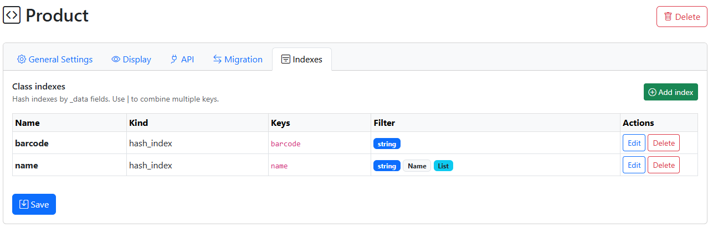
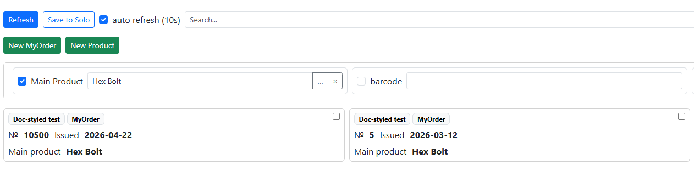

Индексы и отборы в узлах
=============================
  
Ввиду того что хранение в NL – это практически NoSQL, без фиксированной структуры полей, это накладывает некоторые особенности на фильтры и отборы. А именно то, что о них надо позаботиться отдельно, создав индексы. Т.е. отборы работают на индексах, заданных в конфигурации – как пользовательские механизмы, так и программные методы. Такие задачи как поиск по ключу(ключам) одного или нескольких узлов – это тоже к индексам

Настройка индексов
--------------------
  

  
Настройка осуществляется через класс, закладка  Индексы
  
Задаются:
  
 * **Имя** это имя, которое будет использоваться в функциях
 * **Тип индекса** (*На текущий момент доступен только hash-индекс – т.е. по точному соответствию значения)
 * **Ключи** – это может быть одно поле, либо составной индекс из нескольких полей через разделитель – |
  
Отбор в списке узлов (*только для веб-версии)
~~~~~~~~~~~~~~~~~~~~~~~~~~~~~~~~~~~~~~~~~~~~~~~~~

    
Также можно задать пользовательские фильтры (отборы) в списке узлов.
  
Для этого определяется:
  
 * **Заголовок**  - отображаемое имя поля (как оно будет выглядеть в списке узлов)
 * **Тип значения фильтра** – помимо базовых (string, number, Boolean)  доступны и поля типа Узел и Датасет. Например ``Node(Product)`` – фильтр по полям типа «Product»
 * **Доступен список** – можно задавать несколько значений в отборе в виде списка

Функции для работы с индексами (для Python и NodaScript)
------------------------------------------------------------
  
*Для Python функции возвращают объекты-узлы,  NodaScript возвращает _id (в строковом виде), чтобы получить _data узла нужна функция ``getData(_id)``

**getByIndex(class_or_name, index_name, value)** – получить единственное значение по индексу (или первое)

Пример NodaScript
  
.. code-block:: JavaScript

 sku_id = getByIndex("Product","barcode",_data.cam_barcode); //one value result
 if sku_id!=null {
  message(getData(sku_id).name); //getData return _data of node by _id
 }
   
Пример Python
  
.. code-block:: Python

  res = getByIndex("Product","barcode","4690216127392")
  toast(str(res._data["name"]))

   

**findByIndex(class_or_name, index_name, value)** – получить список _id по условию (подходит для использования функциями from_uid)

Глобальные индексы
--------------------------
  
Для любых узлов, в том числе тех, у которых нет класса можно пользоваться индексами, если ключевые поля в _data определять через префикс __ , например __barcode тогда такое поле автоматически считается hash-индексом и по нему ведется индекс. Он уже без класса (как и без конфигурации) и методы работы с ним:

**findByGlobalIndex(index: str, value)** – поиск по отбору по полю, возвращает список _id

**getByGlobalIndex(index: str, value)** – отбор по значению, возвращает один узел(_id)

