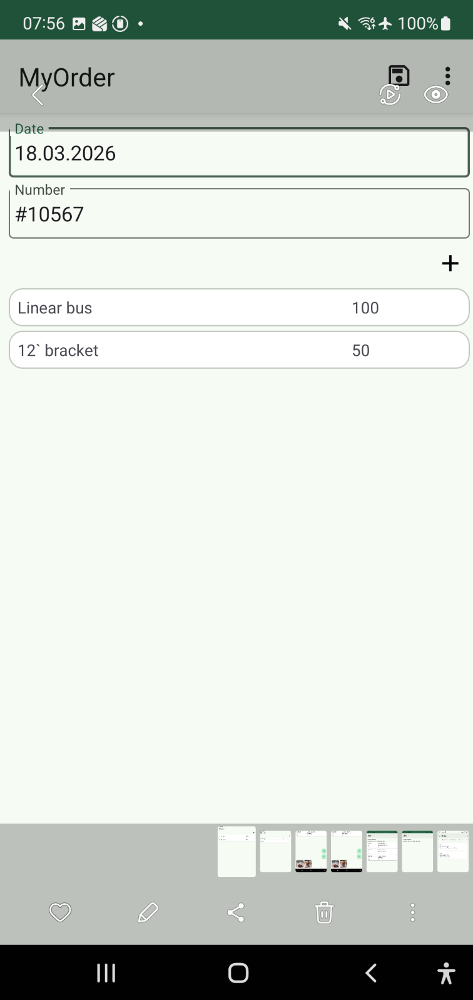
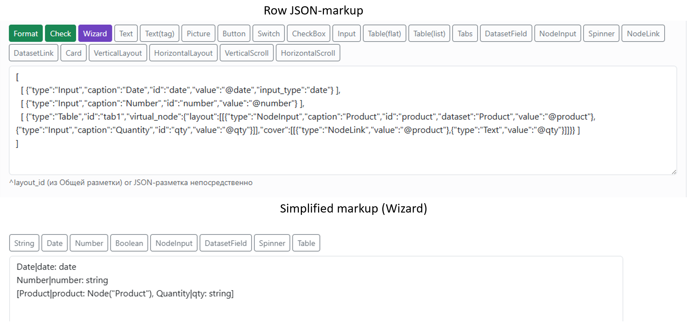

.. NodaLogic documentation master file, created by
   sphinx-quickstart on Wed Nov  5 07:29:33 2025.
   You can adapt this file completely to your liking, but it should at least
   contain the root `toctree` directive.

Приемы упрощения разработки
===============================

Хотя разработка процессов и интерфейсов с помощью встроенного AI-генератора упрощает разработку, тем не менее в NodaLogic есть ряд подходов и паттернов, которые позволяют существенно упростить решение и сделать его более читаемым и компактным. При таких подходах даже AI не потребуется.

Узлы/документы с одним экраном.
-----------------------------------

Когда документ/узел/процесс имеют всего один экран (а это довольно часто встречается), нет смысла подключать обработчик onShow/onShowWeb и делать для него метод на python который просто выполнит self.Show(), self.PlugIn() . Можно просто указать разметку и массив PlugIn на закладке Отображение в Init screen layout/PlugIn /InitScreenLayoutWeb /PlugIn /PlugInWeb. Также как и с обложками полях без «web» разметка задается и для мобильной версии и для веб, но если требуется уточнить именно для web, то поля с окончанием web имеют больший приоритет.

Конечно, если вам нужно что то инициализировать при открытии, то метод все равно придется делать, но такой подход все равно делает решение более читаемым. Эти поля сочетаются с Show/PlugIn методами и конечно можно в любой момент их переопределить из обработчика.

Стандартные кнопки, миграция
--------------------------------

Галочка Использовать стандартные команды подключает типовые кнопки Сохранить, Удалить в формах узла для мобильной и веб-версии. Для веб-версии еще подключается «Удалить выбранные» в списке.

Для мобильной можно использовать автосохранение

На закладке Миграция можно подключить еще одну стандартную кнопку – команда Регистрация. Для мобильной платформы эта кнопка делает upload на сервер по умолчанию (определяется в Серверы конфигурации). Для веб-версии эта кнопка делает аналог команды register для альяса комнаты, заданной в классе на закладке Миграция (а сама комната (физическая) выбирается как соответствие альясу  в разделе Rooms именно конфигурации (в ветке конкретной конфигурации)

Также можно включить Зарегистрировать при сохранении, которое делает тоже самое что и эта кнопка, но надо быть внимательным – сохранении например может быть при любом вводе, не самый лучший вариант, если upload-запрос будет работать при вводе каждой буквы

Автогенерируемая табличная часть
--------------------------------------

  
Часто требуется организовать форму списка строк документа в виде табличной части. Для этого есть несколько подходов с Table и NodeChildren (варианты где строки-отдельные узлы дают гибкость и надежность, есть варианты где строки – просто объекты в массиве в корневом документе) но самый простой подход описан ниже. Для автоматической организации табличной части в форме узла, включая такие действия как добавление/удаление строк открытие формы для редактирования и самой формы редактирования нужно применить «виртуальный узел». Смысл в том что в форме размещается Table и в нем указывается свойство virtual_node – объект который имеет cover (обложка узла – то, как будут выглядеть строки в табличной части) и layout – форма узла (то, как будут выглядеть форма редактирования записи, которая открывается для пользователя когда он хочет отредактировать строку) . Этот узел не храниться отдельно как самостоятельный узел, он сам сохраняется как строка в массиве, в переменной, равной id таблицы. Т.е. virtual_node берет на себя заботу о добавлении/редактировании строк, удалении, упаковки данных в переменную в _data без единой строчки кода. При этом, доступ есть ко всем этим элементам и данным таблицы. Это обычный узел.
Работает и с обычной формой списка и с table=true вариантом.
Вот пример табличной части, где  в строках Товар (другой узел) и количество.

.. code-block:: JSON
  
  {
    "type": "Table",
    "id": "tab1",
    "virtual_node": {
      "layout": [ [{"type": "NodeInput","caption": "Product","id": "product", "dataset": "Product", "value":"@product"},{ "type": "Input","caption": "Quantity","id": "qty","value": "@qty" } ] ],
      "cover": [[{"type": "NodeLink", "value": "@product" },{ "type": "Text", "value": "@qty"}]]
    }
  }

В процессе работы пользователя такая часть, автоматически записывает строки в _data в ключ ``tab1 :[{ "product":..,":"qty":…}]``

Упрощенная разметка/Wizard
-----------------------------------

Это вариант не охватывает все возможности разметки а только базовый сценарий – разметка «строками» (без контейнеров) и использование базовых типов и полей узлов и других датасетов.

Тем не менее для большого охвата задач такой разметки достаточно и ее всегда можно доработать вручную. Это не часть платформы, а просто часть N-Maker которая просто преобразует JSON-разметку в более человеко-читаемую и наоборот

Для разметки ввода (init screen) и разметки отображения (cover) свои правила и наборы доступных полей

Поля задаются в виде ``<Caption>|<id>: <type>``, пример  ``Name|name: string`` . Запоминать это не надо – там кнопки-хелперы. Можно задать через запятую – тогда это будет несколько элементов в «строке» 

Также доступна таблицы, причем их может быть несколько – он сам разместит это в  закладках (Tabs)
